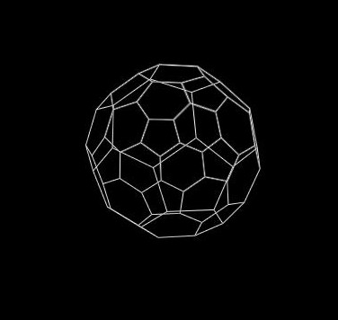

#  **libtiny3d: 3D Software Renderer Library**



# overview of the project

## Task 1
- Floating‑point *canvas* with sub‑pixel bilinear writes & anti‑aliased DDA line drawing 
## Task 2
- Stand‑alone *3D math library* (vectors, matrices, SLERP, fast √⁻¹) 
## Task 3
- Complete *software pipeline* that transforms a soccer‑ball mesh from local space all the way to a clipped, depth‑sorted wireframe on screen 
## Task 4
-  The system supports Lambert lighting and Bézier path animation and smooth moving

# Directory Layout
```
📁libtiny3d/
├─ 📁 include/          # Header files
├─ 📁 src/              # C implementations
├─ 📁 demo/             # demos
├─ 📁 tests/            # tests
├─ 📁 build/            # build files
├─ 📁 Frames            # Store frames in 3D model
├─ 📁 Documentations    #report and presentation
├─ 📁 Assets            #help file to README.md
├─ 📁 Outputs           # Final Outputs
├─ Makefile
└─ README.md
```

# Tasks
## Task 1: Canvas & Line Drawing
### Features
   - Floating-point coordinate 
   - Bilinear filtering
   - DDA algorithm
   - Adjustable thickness

### Data structures
   - Canvas_t
      - width, height (Canvas Dimension)
      - pixels(Brightness value)

### Key Function
   - create_canvas()    --Create canvas
   - free_canvas()      --Free all memory belonging to a canvas
   - set_pixel_f()      --Write intensity into (x,y) using bilinear filtering
   - draw_line_f() --    Draw a line of given thickness Uses the floating-point DDA algorithm
   - save_canvas_pgm()-- Save the canvas as an PGM file
   - canvas_clear()--Clear every pixel

### Build Instruction
1. Compile the program
```
make
```
2. Run the demo
```
./clockface
```
3. Output is clockface.pgm and you can convert it to clockface.png
```
convert clockface.pgm clockface.png
```
4. Clean the build file
```
make clean
```
## Task 2: 3D Math Foundation
### Features
 - Vector operation
    - Dual coordinate representation ( Cartesian & Spherical)
    - Automatically update together system
    - fast inverse square root
    - Smooth transition move and rotation (SLERP)

 - Matrix Operations
    - 4×4 transformation matrices
       - Transform to vector
       - scaling
       - Rotation
    - Identity matrix
    - Matrix multiplication
    - Projection matrix

### Data Structures
 - vec3_t
    - Cartesian coordinates
    - Spherical coordinates
    - Boolean
        - dirty_cartesian
        - dirty_spherical

 - mat4_t
    - 4 × 4 matrix(m[16])

### Key Functions
 - vec3_from_spherical() --Creates a vector from spherical coordinates
 - vec3_update_spherical() --Updates spherical coordinates from Cartesian values
 - vec3_update_cartesian() --Updates Cartesian coordinates from spherical values
 - vec3_normalize_fast() --Normalizes vector using fast inverse square root approximation
 - vec3_slerp()--Spherical linear interpolation between two vectors

 - mat4_identity()--Creates an identity matrix
 - mat4_multiply()--Multiplies two matrices
 - mat4_translate()--Creates translation matrix
 - mat4_scale()--Creates scaling matrix
 - mat4_rotate_xyz()--Creates rotation matrix from Euler angles
 - mat4_frustum()--Creates asymmetric perspective projection matrix
 - mat4_mul_vec3()--Transforms vector by matrix

 ### Build instruction
 1. Compile the program
  ```
  make
  ```
 2. Run the program
   - test_math.c(create cube)
   ```
   ./test_math
   ```
   - test_pipeline.c(show cube projection,movement with rotation)
   ```
   ./test_pipeline
   ```
 3. Outputs are 180 frames in ./Frames/cube and create cube.gif to get movements
   ```
   convert -delay 3 -loop 0 Frames/cube/framecube_*.pgm cube.gif
   ```
## Task 3: 3D Rendering Pipeline
### Features
   - 3D projection
   - Circular viewport
   - Depth sorting

### Data Structures
 - vec3_t:From mat3d.h
 - mat4_t:From math3d.h
 - canvas_t:From canvas.h

### Key functions
 - project_vertex()--Transforms a 3D vertex through the full rendering pipeline
 - clip_to_viewport()--pixel coordinate falls within the circular drawing area
 - render_wireframe()--Renders a 3D model as wireframe with depth sorting

## Demo Function
 - load_obj_geometry() -- get coordinated of soccer ball by .txt file and get vertices and edges

## Build instructions
 1. compile the program
   ```
   make
   ```

 2. Run the program
   ```
   ./soccerball
   ```

 3. Outputs are 200 frames in ./Frames and create soccerball.gif to get rotation soccerball
   ```
   convert -delay 3 -loop 0 Frames/frameb_*.pgm soccerball.gif
   ```
## Task 4: Lighting & Polish
### Features
 - Lambert lighting
 - B´ezier Animation
 - Looping & Sync

### Data Structures
 - animation_t
   - time
   - duration
   - loop

### Functions
 - lighting.h
   - lambert_intensity(): Calculate Lambert lighting intensity
   - vec3_normalize(): Normalize a vec3_t in place

 - animation.h
   - animation_init(): Initialize an animation_t instance for tracking time
   - animation_update(): Advances the animation timer 
   - bezier3():Cubic Bézier interpolation :Computes a point on a cubic Bézier curve at time

### Build instructions
 1. Compile
   ```
   make
   ```

 2. run the program
   ```
   ./main
   ```

 3. Clean the build
 ```
 make clean
 ```

 4. Outputs are 200 frames in Frames folder and create final.gif to get movements
   ```
   convert -delay 3 -loop 0 Frames/frame_*.pgm final.gif
   ```
## Run all tasks
 - In the terminal type below steps
 ```
 make
 make run_all_task
 ```
  - Then all build files are created.
  - All outputs are created in Outputs folder
 1. Get Clockface.pgn
 ```
convert clockface.pgm Outputs/clockface.png
```
 2. Get cube's projection as cube.gif
 ```
convert -delay 2 -loop 0 Frames/cube/framecube_*.pgm Outputs/cube.gif
```
 2. Get rotating soccerball as soccer.gif
 ```
convert -delay 2 -loop 0 frames/frameb_*.pgm Outputs/soccer.gif
```
 3. Get moving dual soccerballs as soccer2.gif
 ```
 convert -delay 2 -loop 0 frames/frame_*.pgm Outputs/soccer2.gif
```


 

